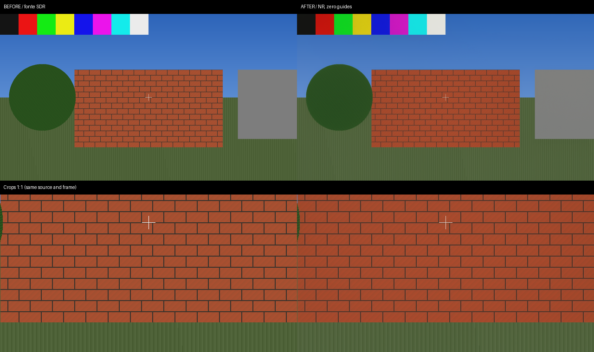

# DLSS-NR loopback harness

A D3D12 application that drives the production Neural Rendering exports without a game.
It creates real input/output resources, submits evaluations, waits on queue fences and sweeps
the output extent to exercise recreation and the post-stage settling gate. Nothing below the
production `OptiScaler.dll` NGX entry points is mocked.

## Scope

The default harness has no swapchain and does not render the planned scene. `scene.hlsl`
exists but is not wired into execution; input contents and motion are not a deterministic
image fixture. The wall-clock sweep tests real initialization, NR composition, resolution
changes and shutdown. Evaluation counts include initialization and skipped NR work.

Passing the default sweep establishes neither image quality, deterministic pixels nor an FPS
improvement. `--present-nr` adds a separate deterministic, static image/readback experiment below.
Analytic motion and controlled A/B timing remain future work. Visual acceptance also requires
testing representative content; the synthetic present fixture cannot establish emulator quality.

## Status

**2026-09-14 — controlled present transport passed; visual quality is not accepted.**

`python3 tests/dlssnr-loopback/run.py --present-nr` ran on RTX 4090, driver 615.71.09,
Proton Experimental, from production baseline `4cbd0950`. All changes for this experiment are
under `tests/`; no production configuration, export, hook or runtime behaviour was changed.

| observation | result |
|---|---|
| standalone core Init/capabilities; model Init/CreateFeature(18) | success (`0x00000001`), three model generations |
| NR evaluations / completed presentations | **48 / 48**, one evaluation per freshly rewritten frame |
| sizes | 1280×720 → 960×540 → 1280×720, 16 frames each |
| source readback before NR | exact fixture bytes on **all 48 frames** |
| `ApplyModel=0` composition controls | **3/3 byte-identical**, despite executing NR |
| pending work on entry to resize | serial 18 vs completed 17; serial 37 vs completed 36 |
| drain before release/ResizeBuffers | **2/2**, successful resize and final device-health checks |
| readbacks saved | **nine before/after pairs**, frames 0, 1 and 15 of each generation |
| DestroyParameters / Shutdown1 | both successful; process exit 0 |

**What the images show:** the geometry, mortar lines and reticle remain recognizable, without
black frames or gross corruption. There is no convincing enhancement of this synthetic scene.
Saturated patches become duller (especially red/yellow), and texture/contrast changes. This is
not a positive quality verdict. RGB mean absolute change at frame 15 was **3.983909/255** at
1280×720 and **5.884574/255** at 960×540 (maximum channel changes 66 and 79). Those numbers
measure *change*, not error against a desired image or improvement. The identical 1280×720
fixtures and outputs at frames 1 and 15 matched byte-for-byte after resize away and back.
The output also changes over the 16-frame history despite a static source; motion quality,
ghosting and longer-term stability were not measured.



[Recorded results and component/readback hashes](evidence/present-step1.txt) accompany the image.
The retained comparison is generation 3, frame 15. Full-size, lossless originals remain in
`artifacts/present-run/g3-f15-{before,after}.ppm`; every new run regenerates all nine pairs.
A PPM is already an image; for PNG, Pillow can convert it without altering RGB values:

```python
from PIL import Image
Image.open("artifacts/present-run/g3-f15-after.ppm").save("after.png")
```

### Controlled present mode: what is exercised

`present_nr.h` owns one real two-buffer `FLIP_DISCARD` swapchain on the **same DIRECT queue**
that executes the neural pass. The format is explicitly `R8G8B8A8_UNORM`, SDR G22/BT.709.
There is no `ALLOW_UNORDERED_ACCESS` on its buffers. The CPU-authored gradient/brick/foliage/
checkerboard/reticle fixture is uploaded afresh for **every** frame; a GPU readback asserts it
still matches before NR. Identity is `(generation, iteration)` by construction, not a guess
from Present count, buffer index, a global epoch or a timeout. Only this harness presents.

The mode initializes the installed NGX core independently (app ID 1337 decimal, empty path,
`NVSDK_NGX_Version_API`, matching the current production SDK fallback). It obtains the core's
real capability block and uses the **production ABI-2 forwarder** for feature 18. It creates
no Super Sampling, Ray Reconstruction or Frame Generation feature and loads no OptiScaler DLL
or Streamline donor. The capability block is not a fabricated upscaler parameter adapter.

The encode and resolve execute the **unchanged, committed production `DlssNr_cso` bytecode**,
with the shared `DlssNrConstants` definition. A small test-only root signature and descriptor
setup binds that shader. This does **not** invoke `DlssNr_Dx12::Dispatch`, its global state,
coverage machinery, `RecordingLease`, settling gates or Submission hooks. It proves model +
shader + owned transport, not that those production integration layers are safe for a future
host. Neither existing production host is replaced by this experiment.

Each generation owns zero depth `R32_FLOAT` and motion `R16G16_FLOAT`, at target size. Matching
CPU and shader-visible UAV descriptors clear them **once**; that command list is submitted
and fence-complete before feature creation/evaluation. Confidence is neither allocated nor
passed. Reset is set on the first evaluation of each recreated model; motion scale is (1,1),
subrect origins zero, all guide extents full size. There is no exposure texture or scan.

The explicitly SDR constants set `Passthrough=1`, white point/pre-exposure multiplier 1:
the already-tonemapped frame is not encoded a second time. Thus this route does avoid the
HDR white-point/exposure inference problem; it does **not** guarantee colour preservation
when the model's edit is applied. Model preset/style are 0, intensity/local strengths are 1,
AutoMask is 1. `UICorrection=1` matches production, now on a frame with HUD-like detail;
there is no evidence here that it protects arbitrary game UI. Composition uses the defaults
strength=1, colour=1, max ratio=2, Transfer=1, at **full working resolution**, one pass.
No working-scale/residual-upscaling speed claim is made.

The recording order is explicit:

1. Resting backbuffer `PRESENT` → `COPY_DEST`: rewrite the entire clean fixture from upload.
2. Backbuffer → `COPY_SOURCE`: capture *before* and copy out to a private RGBA8 texture.
3. Production encode → RGBA16F proxy/untouched copy; feature 18 → separate RGBA16F answer;
   production resolve → private RGBA8 UAV. Read/write transitions order each consumer.
4. Copy back to the backbuffer, capture *after*, restore `PRESENT`; submit and signal a fence
   **after the entire recording**, including both transport copies and both readbacks.
5. Prove completion before `Present(1, 0)`; accept only `S_OK`. The test checks the returned
   backbuffer pixels and successful Present calls, not physical display scanout with a camera.

D3D12 cannot query a backbuffer's current state. There is no assumption that an unknown game's
buffer is a render target here: the harness owns and specifies every state transition.
Waiting before the flip follows the donor's write-back lesson without importing its FG
stand-down heuristic. This synchronous wait can include all queued inference; it is **not**
claimed cheap, and this heavily instrumented probe is not a performance benchmark.
At 1280×720 the two transport copies carry 7,372,800 bytes of payload total; source upload,
readbacks, encode/resolve and model work are additional. Shrinking model work alone would
not shrink the backbuffer copies. No Cyberpunk millisecond measurement is reused as a
measurement of this fixture.

For each resize request the real queue is held behind a test fence before the final
NR/copy-back submission. The test verifies that the submission is still pending on entry.
A separate CPU thread releases that gate after 100 ms; the resize path drains first, inspects
and presents the completed image, then fences the queue again before releasing **any** model,
texture or backbuffer reference and calling `ResizeBuffers`. All new resources/guides and
the model are then recreated. A fast GPU cannot turn this into an idle-only resize test.
Final teardown follows the same completion-first rule. Allocator, upload/constant writes and
descriptor reuse also occur only after proven completion.

Waits use one 10-second deadline, one event registration, and reread completion/removal after
every wake, including timeout. A failed Signal is already marked pending. Any failure logs
its stage/result and ends this diagnostic process **before unwinding outstanding GPU-owned
objects**; there is no successful fallback or resource reuse on unknown completion. This is
test-process failure handling, not a deferred-retirement implementation for an injected DLL.

**Limits:** static synthetic content, one device/queue/swapchain, SDR RGBA8, no concurrent
presents, no device replacement, no arbitrary-game resource-state/frame-identity proof,
no BGRA/HDR/FG support, no engine guides, and no removal/failed-Signal fault injection.
The two controlled pending resizes are real GPU evidence, not coverage of every driver race.
The 12 host suites do not exercise this host. The existing `dlssnr-loopback` wine suite gains
an opt-in mode, so `suites.toml` needs no new entry; its default remains the old upscale sweep.
The compiler-prefix busy check and isolated Proton prefix are preserved.

Verification on 2026-09-14: `./build-local.sh Release` completed successfully; the pinned
`/usr/lib/llvm20/bin/clang-format --dry-run --Werror` passed for both touched C++ files;
`python3 tests/run_all.py` passed **12/12**. The new Proton mode passed twice, the unchanged
`--cold-nr` mode passed 48/48, and the default upscale sweep passed (5 creates, 4739 upscale
evaluations, NR composition log coverage, successful Shutdown). Upscale/log counts are not
counts of model evaluations. The runner's acceptance check also rejected missing/truncated
PPMs and each incomplete counter in synthetic parser checks; those checks prove no GPU property.

**2026-09-13 — cold start accepted under Proton.**
`python3 tests/dlssnr-loopback/run.py --cold-nr` adds a separate experiment; the default sweep
below still runs unchanged. On RTX 4090, driver 615.71.09, Proton Experimental, at 640x360:

| call / observation | result |
|---|---|
| core `NVSDK_NGX_D3D12_Init_Ext` | `0x00000001` (success) |
| core `GetCapabilityParameters` | `0x00000001` |
| model `Init_Ext`, through the production forwarder | `0x00000001` |
| model `CreateFeature(18)`, through the production forwarder | `0x00000001`, non-null handle |
| model `EvaluateFeature(18)` | **48 attempted, 48 successful, 48 GPU submissions fence-complete** |
| core `DestroyParameters` / `Shutdown1` | both `0x00000001`; process exit 0 |

The core receives **1337 decimal**, an **empty data path**, **SDK version 0**, and no search paths.
These are the untouched metadata defaults in `State.h:219-225`, passed by
`NVNGXProxy::InitDx12`; there is no retry with a different ID, path or version. The model then
receives the production forwarder's own generic ID `0x24480451` and SDK `0x15`, as it does today.
No game-style OptiScaler Init export is called, no DLSS super-sampling or ray-reconstruction feature
is created, and no donor DLSS/Streamline DLLs are staged in the cold directory. The loader trace
confirmed the core, forwarder and NR model loaded, without OptiScaler, DLSS SR or Streamline DLLs.

This answers the narrow falsification question positively: **these cold metadata and owned zero
guides are accepted without a prior upscaler initialization in this process**. It does not execute
`EnsureCapabilityParams` or the OptiScaler proxy/loader itself: the EXE calls the real core's
`Init_Ext` and capability export directly, then the **existing production forwarder**. The public
OptiScaler Init would populate game state and can report success despite core init failure
(`inputs/NVNGX_DLSS_Dx12.cpp:167-190,225`); simply changing the old sweep's feature enum would instead
select native core passthrough (`:806-814`), not the forwarder used by the normal NR pass. Neither
would isolate this question correctly. No production code was changed or rebuilt.

The first runs also passed with the kit's older core (file version 32.0.16.1088). That file differed
from the installed driver's core, so the cold mode now prefers `/usr/lib/nvidia/wine/_nvngx.dll`
(32.0.16.1691 here), with the kit as fallback if that path is absent. The default sweep still selects
the same kit as before. The current-core run used these SHA-256 identities:

| binary | SHA-256 |
|---|---|
| installed `_nvngx.dll` | `172faedfd9b1c7faddf07b846667484fcf35d8a4cae17d1abada5e94714071db` |
| production `nvngx.dll_dlssnr.dll` | `bda010710eb17e497d580102cf56e8b59e27dd638f2c27fc3e6125396a8419b7` |
| model `nvngx_dlssnr.dll` | `6eb209e764f39872625debd6abaf45e2bb6322f6f270f781f70c059ae30b3927` |

Local evidence is retained in `artifacts/cold-evidence-current-driver/` (harness and Proton logs,
binary manifest), and the earlier kit-core run in `artifacts/cold-evidence/`. These are ignored
runtime artifacts, not shipped DLLs. Removing only the test-directory core link produced the
expected nonzero result: `LoadLibraryExW(.\_nvngx.dll): Win32=126`, `stage=load core`, zero evaluations;
the link was restored. The coverage consumer also rejected empty output, legacy-only `PASS`, failed
evaluations and incomplete GPU submission counts. These checks do not simulate GPU failures.

The legacy mode passed on the same harness source: five creations, 907 upscale evaluations,
NR composition reached, shutdown `0x00000001`, exit 0. Counts from its timed sweep are not a
performance comparison. All **12/12 host suites** passed; the suite registry is unchanged.
The test C++ compiled with msvc-wine and passed pinned clang-format 20. `build-local.sh` was not run.

### Cold-mode contract and limits

`cold_nr.h` allocates owned depth `R32_FLOAT` and motion `R16G16_FLOAT` at target size. It clears
each exactly once to zero using a CPU-only UAV descriptor plus its matching descriptor in the bound
shader-visible heap. Transitions to SRV state and a submitted, completed fence precede the first
evaluation. Confidence is neither allocated nor set in the NGX block. Colour and output are separate
`R16G16B16A16_FLOAT` textures; every iteration rewrites the entire colour input with a deterministic
four-colour sequence, never reading the previous output. Reset is 1 only for the first evaluation,
motion scale is `(1,1)`, subrects cover the whole target, and depth inversion is off.

Each initialization/evaluation prints its result in hexadecimal. Failures name the stage and counts;
loader errors include Win32 codes, D3D12 failures include HRESULTs. If snippet init refuses, the
forwarder's last-create diagnostic remains its initial zero because creation was not reached. The runner only accepts
the cold success summary with all 48 evaluations successful **and** fence-complete; the old
composition-log check is deliberately reserved for the old mode. A failed submission or wait never
recycles an allocator: the diagnostic process exits before releasing potentially in-flight resources.
Waits check removal and actual fence completion after every wake with the original ten-second
deadline. Timeout/device-removal paths were reviewed, not induced on the live GPU.

Use `--skip-build` to reuse the selected mode's binary in `artifacts/cold-run/` or `artifacts/run/`.
The compiler-prefix busy guard is preserved. The modes share the suite's Proton runtime prefix and
must run serially. `--dll` still selects the build whose adjacent forwarder is preferred; the cold
mode does not load that OptiScaler DLL. Bare `--runtime wine` cold execution was not validated.

Success proves API acceptance and completed submissions, **not** pixels, inference timing, temporal
quality, a usable emulator integration, or the correctness of a future Present host. There is no
readback, swapchain or composition pass in this mode. Conversely, a refusal of these metadata would
falsify using those defaults unchanged, not rule out a host initializing NGX with its own explicit
metadata. Neither outcome settles the remaining presentation/lifetime hazards.

### Existing after-upscale sweep

`python3 tests/dlssnr-loopback/run.py` builds the harness with the msvc-wine toolchain, sets up
a disposable runtime prefix with vkd3d-proton borrowed from the local Proton install, links the NR
kit (forwarder, model, `_nvngx.dll`) and a donor game's DLSS/Streamline DLLs beside the production
`OptiScaler.dll`, and runs it. It refuses to start while `build-local.sh` holds the compiler prefix.

What works: a real D3D12 device on the GPU, all `NVSDK_NGX_D3D12_*` exports resolved from the
production DLL, `Init` and `CreateFeature` (DLSS super-sampling) succeeding, and thousands of
`EvaluateFeature` calls across a scripted sweep of render extents. The NR module is reached — its
spatial contract, guides and exposure scan all log — and the post-stage settling gate fires once on
the cold start, as designed.

**The NR pass composes — under Proton.** `--runtime proton` (the default) runs the harness through
the local Proton install in a compatdata prefix of its own, and the model runs: 672 applied
evaluations, zero failures, on the first attempt. Under a bare Wine prefix (`--runtime wine`) the
same binary reaches NR but the model's `CreateFeature` returns `0xBAD00002` (`FAIL_PlatformError`).
Mirroring Proton by hand did not close that gap: `_nvngx.dll` matches the driver byte for byte,
`nvngx_dlss.dll` and the eleven Streamline DLLs change nothing, and adding dxvk-nvapi plus the
driver's `nvngx.dll` and the `NGXCore` registry key moved the failure to NGX core init and then to
a page fault. The model links NVAPI (45 `NvAPI_` references) and expects the environment Proton
assembles; nothing here reproduces that by hand. If NR does not compose, the runner **fails** with
`ZERO COVERAGE: the NR pass never composed a frame` rather than passing on the upscaler alone.

The harness writes `dlssnr-loopback.log` beside itself, flushed per line, because Proton does not
pass a child's stdout through and a crash discards buffered output. The runner prints it, and
`PROTON_LOG=1`, `SteamGameId=0` and explicit exception tracing land wine-side crash logs in
`artifacts/steam-0.log`. The neutral ID is required by Proton's log setup and selects no game profile.
Previously the missing ID prevented that file from being created, while `WINEDEBUG=-all` also
suppressed the exception trace.

The compiler watchdog matches MSVC paths case-insensitively (`Hostx64/x64/cl.exe` is the local
spelling), and monitors the wrapper if it has not spawned a compiler. An empty PID match must not
disable stall recovery indefinitely.

The generated INI selects `OverlayMenu=true`. This is the **swapchain overlay route**, not an
"enable all menus" switch. The harness has no swapchain, so this avoids the in-upscaler ImGui path.
`OverlayMenu=false` used to activate that unrelated path and could crash at
`Menu_Dx12::Render` with a null ImGui context during the sweep. Both the pre-optimization DLL
(`fb079c16`) and the persistent-mapping DLL (`61eabbce`) failed with that configuration. This runner
configuration isolates NR validation; it does not fix the production menu lifetime issue.

With the corrected harness, the persistent-mapping build completed all seven extent steps with
5 feature creations and 4268 upscale evaluations, and logged NR composition at both output sizes.
It then reproduced the known `Shutdown1` access violation inside `_nvngx.dll` (RVA `0x3af44`).
Those historical runs were failed suites, not runtime acceptance or FPS measurements.
The immediately preceding DLL (`fb079c16`) also completed this corrected harness (4487 evaluations)
and failed at the same `_nvngx.dll` RVA `0x3af44` during `Shutdown1`. These single-run evaluation
counts include skipped work and initialization and must not be interpreted as performance results.

What the first Proton run taught about the settling gate: it keys on the resource the pass composes
into, the upscaler's **output**. Sweeping only the render extent never trips it — the model takes
the guides as a subrect and was built once across five render sizes. The sweep therefore changes
the output extent, which is what a game's resolution change does.

The corrected core-shutdown ABI adapter now completes this same sweep and shutdown:
5 creates, 4371 upscale evaluations, NR composition at both output sizes, shutdown result
`0x00000001`, process exit 0. The raw core export needs writable output storage in its
second argument; using the public SDK's one-argument typedef left it unspecified.
See `OptiScaler/dlssnr/design/ngx-shutdown-order.md` for the binary evidence and scope.
The runner also verifies the shutdown result and prefers the forwarder built beside the
selected DLL. Logs and hashes are retained in `x64/dispatch-validation/core-abi/`.

The final build `20260905_224708` also passes with GPU timing off and on. The enabled run
used the same binary and INI with `GpuTiming=true` and `GpuTimingInterval=30`, then called
this runner's `run_under_proton()` directly to preserve those settings. It produced confirmed
GPU samples and three expected contract generations across the extent changes. This validates
the instrumented path, not comparable frame-time or image-quality measurements.

Still to do: the deterministic scene (`scene.hlsl` is written, not yet wired), analytic
motion and frame dumps for controlled run-to-run comparison.

A stage that cannot reach its own instrumentation must fail loudly rather than pass quietly;
that is the `ZERO COVERAGE` rule the Vulkan harness established and this one inherits.
